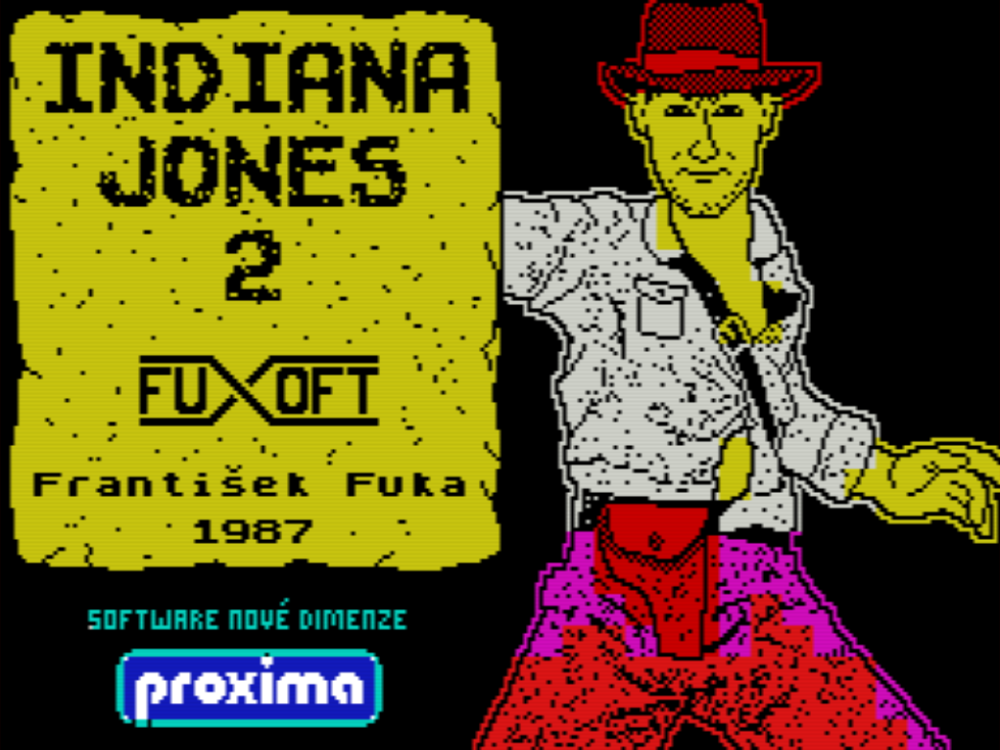

# Indiana Jones 2

## Day 0: Not Too Short Introduction to Python

* [Guess the Number](day.0/000-basics.md)

## Day 1: The Basics

* [Program Flow](day.1/110-program.flow.md)
* [Game State](day.1/120-game.state.md)
* [Creating of Own Functions](day.1/130-own.functions.md)
* [Main Building Blocks of the Game](day.1/140-main.building.blocks.md)
* [About Dataclasses](day.1/145-about.dataclasses)
* [Dataclass for Abstract Command](day.1/150-dataclass.command)
* [Command `about`](day.1/160-command.about)
* [Command `commands`](day.1/170-command.commands.md)
* [Command `quit`](day.1/180-command.quit.md)
* [Daily Cheat Sheet](day.1/daily.cheat.sheet.md)

## Day 2: The Commands

* [Raising an Exception](day.2/200-raising.an.exception.md)
* [Working with Lists](day.2/210-lists.intro.md)
* [Parsing Commands](day.2/225-parse.line)
* [Dataclass for Generic Room](day.2/230-room.representation.md)
* [Creating New Room](day.2/240-new.room.md)
* [Command `look around` and `__str__()` Method](day.2/250-look.around.md)
* [Dataclass for Generic Item](day.2/280-item.representation)
* [Item _Whip_](day.2/285-whip)
* [Item _Empty Seats_](day.2/290-empty.seats)
* [Daily Cheat Sheet](day.2/daily.cheat.sheet.md)

## Day 3: The Items

* Backpack and Game Context
* [Inventory](day.2/220-inventory)
* [Color Output with rich](day.2/224-rich)
* [Command `examine`](day.3/325-examine.and.parser.refactoring)
* Extended Item Examination
* Item Parachute
* [Command `take`](day.3/360-take.item.md)
* [Command `drop`](day.3/370-drop.item.md)

## Day 4: The World

* Stack Trace
* The World and Connected Rooms
* Command `down`
* Commands `north`, `south`, `east` and `west`
* [Place Created Items into Room](day.2/295-items.in.room)
* [Command `use`](day.4/480-use.item.md)

## Day 5

* [Correct Main Module](day.5/599-correct.main.md)
